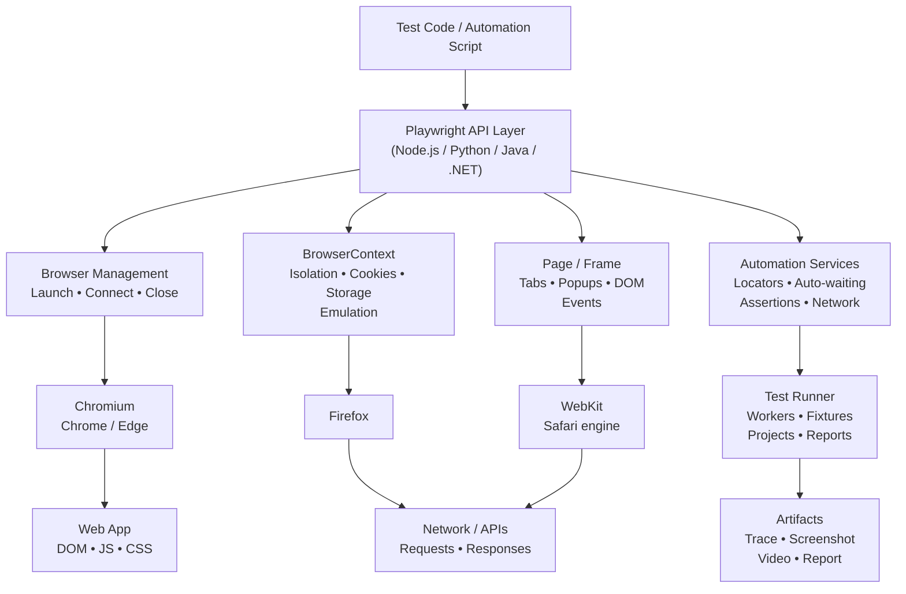

# Playwright Architecture

**Detailed Technical Research Report**

*Browser Automation • Test Execution • Isolation • Parallelism • Observability*

**Prepared:** 11 September 2026
Based primarily on current official Playwright documentation, supplemented by architecture analysis.

---

## 1. Executive Summary

Playwright is a cross-browser automation framework designed to drive modern web applications through a unified API. Its architecture combines a high-level automation API with browser engines, isolated BrowserContexts, Pages/Frames, resilient Locators, network controls, and a dedicated test runner. The architecture is deliberately layered: test code expresses intent; Playwright translates that intent into browser operations; browser contexts provide clean state boundaries; pages expose the web surface; and the underlying browser engines perform rendering and JavaScript execution.

A key architectural idea is that a BrowserContext is a lightweight, isolated browser session. Multiple contexts can share one browser process while keeping cookies, local storage and session state separate. This gives Playwright both strong test isolation and efficient multi-user or parallel scenarios.

Playwright Test extends the core automation library with workers, fixtures, projects, retries, sharding, configuration and reporting. The result is an architecture that scales from a single local end-to-end test to large CI suites running across browsers and machines.

## 2. Scope and Research Method

This report focuses on Playwright's logical and runtime architecture rather than reverse-engineering private internal implementation details. It distinguishes stable public concepts — such as Browser, BrowserContext, Page, Locator, projects and workers — from implementation details that may change between releases.

- **Primary sources:** current Playwright documentation and official Playwright repository documentation.
- **Architecture diagram:** original conceptual diagram prepared for this report.
- **Analysis areas:** component hierarchy, runtime flow, isolation, browser support, test execution, concurrency, networking, and observability.

## 3. Architecture Diagram

*Figure 1. Conceptual Playwright architecture — showing the main control, isolation, execution and observability layers.*



The diagram separates the user-facing API from execution concerns. In practice, the exact internal transport and process boundaries can vary by browser and Playwright version; therefore, the diagram should be read as a logical architecture rather than a wire-level protocol specification.

## 4. Core Architectural Components

### 4.1 Test Code / Automation Script

The application or test code is the top-level consumer. It expresses actions and expectations such as navigating, locating elements, filling forms, clicking controls and asserting state. Playwright provides language bindings for JavaScript/TypeScript, Python, Java and .NET.

### 4.2 Playwright API Layer

The API layer presents a consistent programming model across supported browsers. It exposes browser lifecycle, contexts, pages, frames, locators, network routing, events, screenshots and related automation capabilities.

### 4.3 Browser

A Browser represents a launched browser instance. Playwright supports Chromium, Firefox and WebKit browser engines. Browser binaries are version-coupled with Playwright releases, so the official installation flow can download compatible binaries.

### 4.4 BrowserContext

BrowserContext is the central isolation boundary. A context behaves like an isolated, incognito-style browser profile. Cookies, local storage, session storage and other browser state are separated between contexts. Multiple contexts can coexist within a single browser instance.

### 4.5 Page and Frame

A Page corresponds to a browser tab or popup. It is the main surface used for navigation and interaction. Pages can contain frames, and context-level settings can apply across pages. A single context can host multiple pages.

### 4.6 Locator

Locators are a central abstraction for finding elements. They support resilient interaction patterns and are tightly connected to Playwright's auto-waiting and retry behavior. This reduces the need for manually inserted sleep calls.

### 4.7 Network and API Controls

Playwright can observe and control network traffic at the browser-context level, including routing requests. It also exposes API testing facilities associated with a BrowserContext, allowing browser and API workflows to share relevant context state.

### 4.8 Playwright Test Runner

Playwright Test adds orchestration above the browser automation library. Its architecture includes fixtures, worker processes, projects, retries, parallel execution, sharding, web-server integration, reporters and test configuration.

## 5. Object and Responsibility Hierarchy

| Layer / Object | Primary responsibility | Typical relationship |
|---|---|---|
| Playwright | Entry point for browser types and automation capabilities | Owns/creates Browser types |
| Browser | A launched browser instance | Contains multiple BrowserContexts |
| BrowserContext | Isolation and browser-session state | Contains one or more Pages |
| Page | Tab/popup interaction surface | Contains Frames; uses Locators |
| Frame | Document/frame-level browsing context | Part of a Page |
| Locator | Element discovery and interaction | Targets DOM elements |
| Test Runner | Orchestration, fixtures, workers and reporting | Executes tests using Playwright |
| Project | Named test configuration | Can target browsers/devices/environments |
| Worker | OS process executing test work | Runs test files and worker-scoped fixtures |

## 6. Runtime Execution Flow

1. The test runner or user script initializes Playwright and selects a browser type.
2. A Browser instance is launched or connected to.
3. A BrowserContext is created to establish an isolated session.
4. One or more Pages are created inside the context.
5. The test navigates to an application and uses Locators to find UI elements.
6. Playwright waits for required actionability conditions before interaction where applicable.
7. The browser engine executes the requested browser operations and updates the page.
8. Assertions validate expected application state.
9. Optional network interception, screenshots, traces, videos or other artifacts capture execution evidence.
10. The context and browser are closed, releasing resources and ending the isolated session.

## 7. BrowserContext as the Key Isolation Boundary

Playwright's BrowserContext model is one of its most important architectural decisions. Instead of relying on a single long-lived browser profile and manually cleaning state between tests, a test can begin with a fresh context. This approach reduces state leakage and makes tests more reproducible.

- Each context has its own cookies and storage state.
- Multiple contexts can represent different users in one scenario.
- Contexts are designed to be fast and inexpensive compared with launching an entirely new browser process.
- A Page belongs to a context; popups created from a page remain within that context.
- Context-level capabilities include emulation, permissions, routing and other session controls.

Architecturally, this creates a useful separation: the browser process supplies the engine, while the BrowserContext supplies the test's logical session boundary.

## 8. Cross-Browser Architecture

Playwright targets three major browser engines: Chromium, Firefox and WebKit. Rather than writing separate automation APIs for each engine, test code uses a common Playwright abstraction. Projects can then run the same logical tests with different browser configurations, device emulation and environments.

- Chromium enables coverage of Chromium-based behavior, including Chrome/Edge-style environments.
- Firefox provides coverage against Mozilla's browser engine.
- WebKit provides coverage aligned with the engine used by Safari.
- Projects make cross-browser execution a configuration concern rather than a test-code rewrite.

This architecture is particularly valuable for regression suites because the same test intent can be evaluated across multiple browser engines.

## 9. Locators, Auto-Waiting and Reliability

Playwright treats Locators as a core abstraction rather than encouraging direct, timing-sensitive DOM manipulation. A Locator represents a way to find an element at the time an action is performed. Playwright's actionability checks and retry behavior help synchronize automation with dynamic web applications.

This is an architectural reliability feature: synchronization is moved closer to the interaction abstraction, reducing the amount of explicit timing logic embedded in test code.

- Prefer user-facing or semantic locators such as roles, labels and text where appropriate.
- Avoid arbitrary fixed delays as a synchronization strategy.
- Use assertions as part of the test's observable contract.
- Treat unstable selectors and hidden timing assumptions as architecture-level sources of flakiness.

## 10. Playwright Test Runner Architecture

Playwright Test is more than a browser wrapper. It is an orchestration layer that manages how tests are configured, isolated, scheduled, retried and reported.

- **Workers:** Tests are executed in independent OS worker processes. Workers can run concurrently, and a worker owns its execution environment.
- **Fixtures:** Fixtures establish and tear down the environment required by tests. They can be test-scoped or worker-scoped.
- **Projects:** Projects group tests under a configuration and can represent different browsers, devices, environments, or setup dependencies.
- **Retries:** Failed tests can be retried according to configuration. This helps distinguish transient failures from persistent defects.
- **Sharding:** Large suites can be divided across multiple CI jobs, reducing total wall-clock execution time.
- **Reporters / artifacts:** The runner can generate reports and execution artifacts that support debugging and CI visibility.

## 11. Parallelism and Scalability

Playwright Test uses worker processes for parallel execution. By default, test files can run in parallel while tests within a file run in declaration order unless parallel mode is enabled. The worker model is important because it creates a process-level boundary for test execution and supports scaling across CPU cores.

- Configure a worker limit to control CPU and resource consumption.
- Use fully parallel execution when tests are genuinely independent.
- Avoid shared mutable test state and shared backend records that create race conditions.
- Use worker-specific data or fixtures for resources that must be isolated.
- Use sharding to distribute a large suite across multiple CI machines.

## 12. Network and API Architecture

The BrowserContext is also a useful network boundary. Playwright can route or modify requests made by pages in a context. This enables patterns such as request mocking, controlled test data, blocking selected resources and observing application traffic.

The API request capability associated with a BrowserContext can reuse context-related cookies. This is useful when a workflow needs to combine direct API setup with browser-based UI validation.

## 13. Observability and Debugging Architecture

Reliable browser automation requires evidence when a test fails. Playwright's architecture therefore includes multiple observation surfaces such as screenshots, video, traces, console/page events, network information and test reports. These artifacts turn a single pass/fail result into a diagnosable execution record.

- Screenshots show the visual state at a relevant point in execution.
- Video can capture the browser session for later inspection when configured.
- Tracing can capture detailed execution information for post-failure investigation.
- Reports aggregate test outcomes and artifacts for developers and CI systems.

## 14. CI/CD Deployment Architecture

A typical CI architecture places the Playwright Test runner inside a build agent. The agent installs compatible browser binaries, starts the application under test if necessary, executes tests using a configured worker count, stores artifacts, and publishes a report.

For large suites, projects can represent browser/device matrices while sharding divides execution across CI jobs. This creates a horizontal scaling model: more workers increase concurrency within a machine; more shards increase concurrency across machines.

## 15. Example Architectural Test Flow

```javascript
import { test, expect } from '@playwright/test';

test('user can complete checkout', async ({ page }) => {
  await page.goto('/shop');

  await page.getByRole('link', { name: 'Products' }).click();
  await page.getByRole('button', { name: 'Add to cart' }).click();

  await expect(page.getByText('Cart (1)')).toBeVisible();
});
```

Architecturally, this short test hides substantial infrastructure: the runner supplies an isolated Page fixture; the Page belongs to a BrowserContext; the context belongs to a Browser; Locators provide element discovery; and the assertion participates in Playwright's synchronization model.

## 16. Architectural Strengths

- Unified cross-browser automation model.
- Strong test isolation through BrowserContext.
- Locator-centric interaction model with built-in synchronization.
- Parallel worker architecture suitable for CI scaling.
- Projects allow one suite to target multiple browsers, devices and environments.
- Fixtures provide reusable, structured setup and teardown.
- Network control supports realistic integration and mocking strategies.
- Tracing and artifacts improve failure diagnosis.

## 17. Architectural Trade-offs and Risks

- Browser binaries consume non-trivial disk space and may require system dependencies in CI.
- High parallelism can overload the application under test, databases, third-party APIs or CI runners.
- Poorly designed selectors can still produce brittle tests even with Playwright's Locator model.
- Shared backend state can reintroduce flakiness despite browser-level isolation.
- Cross-browser compatibility is improved but not guaranteed; the application itself may behave differently across engines.
- Retries can hide flaky behavior if teams treat repeated passes as success rather than investigating root causes.
- A large trace/artifact strategy can increase CI storage requirements.

## 18. Recommended Enterprise Reference Architecture

1. Application under test deployed to an isolated test environment.
2. Playwright Test repository with page-object or component abstractions only where they improve maintainability.
3. Reusable fixtures for authentication, test data, services and environment setup.
4. Projects for Chromium, Firefox and WebKit, plus selected mobile/tablet profiles where required.
5. Controlled worker counts for local and CI execution.
6. Independent test data per worker/test to prevent cross-test collisions.
7. Trace-on-first-retry or failure-oriented artifact collection to control storage cost.
8. CI sharding for suites whose runtime is too large for a single machine.
9. A reporting layer that exposes pass/fail, flaky-test trends and artifact links.

## 19. Conclusion

Playwright's architecture is best understood as a layered automation platform. The core library supplies a unified browser automation abstraction; BrowserContexts establish fast, isolated session boundaries; Pages and Frames expose browser surfaces; Locators provide resilient element interaction; and Playwright Test adds the orchestration required for scalable software testing.

The most consequential architectural ideas are isolation, browser abstraction, synchronization at the locator/action layer, and process-based parallel execution. Together they allow teams to move from small local end-to-end tests to large cross-browser CI systems without changing the fundamental programming model.

## 20. References and Sources

- [Playwright — Pages](https://playwright.dev/docs/pages) — https://playwright.dev/docs/pages
- [Playwright — Isolation / Browser Contexts](https://playwright.dev/docs/browser-contexts) — https://playwright.dev/docs/browser-contexts
- [Playwright — BrowserContext API](https://playwright.dev/docs/api/class-browsercontext) — https://playwright.dev/docs/api/class-browsercontext
- [Playwright — Locator API](https://playwright.dev/docs/api/class-locator) — https://playwright.dev/docs/api/class-locator
- [Playwright — Browsers](https://playwright.dev/docs/browsers) — https://playwright.dev/docs/browsers
- [Playwright — Projects](https://playwright.dev/docs/test-projects) — https://playwright.dev/docs/test-projects
- [Playwright — Fixtures](https://playwright.dev/docs/test-fixtures) — https://playwright.dev/docs/test-fixtures
- [Playwright — Parallelism](https://playwright.dev/docs/test-parallel) — https://playwright.dev/docs/test-parallel
- [Playwright — Sharding](https://playwright.dev/docs/test-sharding) — https://playwright.dev/docs/test-sharding
- [Playwright — Test Configuration](https://playwright.dev/docs/test-configuration) — https://playwright.dev/docs/test-configuration
- [Playwright — Best Practices](https://playwright.dev/docs/best-practices) — https://playwright.dev/docs/best-practices

*End of report*